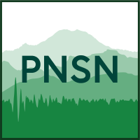

.. Ayahos documentation master file, created by
   sphinx-quickstart on Fri May 17 09:08:57 2024.
   You can adapt this file completely to your liking, but it should at least
   contain the root `toctree` directive.

Welcome to Ayahos (ʔayahus)
===========================

   Representation of  ʔayahus_, Photo from the Curtis Collection (Public Domain)

      "...a supernatural being called *a'yahos* [ʔayahus],
      which is often described in a way that
      could refer to earthquake effects and 
      particularly landslides. The *a'yahos* is
      a shape-shifter, often appearing as an 
      enormous serpent, sometimes with double-headed
      blazing eyes and horns, or as a composite
      monster having the forequarters of a deer and
      the tail of a snake (Mohling, 1957)."
      
   Excerpt from `Ludwin et al. (2005)`_ "Serpent Spirit-Power Stories Along the Seattle Fault"

Connecting Python ML Seismic Analyses to Earthworm
------------------------------------------------------------

Ayahos (ʔayahus) is an open-source python project connecting machine learning (ML)
seismic analysis tools to the Earthworm_ automated seismic processing system. It is 
developed for on-the-fly data processing to bridge the gap between streaming data
modalities in Earthworm and structured data requirements of ML analysis tools, building
off the processing frameworks of SeisBench_, PhaseWorm_, and ELEP_. Most processing in Ayahos is
conducted as in-place changes to data-objects and data copying is kept to a strict
minimum. 

Ayahos builds on popular Python APIs used in the seismological research community for 
routine data processing (ObsPy_ and NumPy_) and ML enhanced analysis tasks 
(SeisBench_ and PyTorch_). It uses the PyEarthworm_ API to broker in-memory data
transfers between Earthworm and Python. Through this development philosophy, we
seek to provide a familiar, modular Python API that can adapt to:

   1) operate on streaming data across scales
   2) meet Earthworm installation operators' needs and resources
   3) enable rapid integration of emerging ML tools with Earthworm

System Overview
---------------

Regarding Names 
---------------
This project was developed in the Puget Sound, where the ʔayahus is associated
with several earthquake-related landforms and considered one of the most powerful,
and dangerous, personal spirit powers in native oral traditions of the region.
Design principles of our project echo many traits of the ʔayahus and our intent
in naming our project is to honor this spirit and beliefs surrounding it. 
Our project was initially named Wyrm as its key components, `Earthworm` and `PyTorch`, 
echo descriptions of Wyrms in European folklore: subterranean, fire-breathing serpents.

We use both names, *Wyrm* and *Ayahos*, to distinguish between submodule classes
and the primary module class, respectively, and as a nod to uniqueness in these
oral traditions:

   There are many Wyrms, but only one ʔayahus. 

.. toctree::
   :maxdepth: 2
   :caption: Contents:

Indices and tables
==================

* :ref:`genindex`
* :ref:`modindex`
* :ref:`search`

   From the `Pacific Northwest Seismic Network`_

.. Hyperlinks
.. _ʔayahus: https://en.wikipedia.org/wiki/Ayahos
.. _Earthworm: http://www.earthwormcentral.org
.. _ObsPy: https://docs.obspy.org
.. _NumPy: https://numpy.org
.. _PyTorch: https://pytorch.org
.. _SeisBench: https://seisbench.readthedocs.io/en/stable/
.. _PyEarthworm: https://github.com/Boritech-Solutions/PyEarthworm
.. _`Serpent Spirit-power Stories along the Seattle Fault`: https://doi.org/10.1785/gssrl.76.4.426
.. _`Ludwin et al. (2005)`: https://doi.org/10.1785/gssrl.76.4.426
.. _PhaseWorm: https://pubs.geoscienceworld.org/ssa/srl/article/93/3/1673/611795/A-Wrapper-to-Use-a-Machine-Learning-Based
.. _ELEP: https://ieeexplore.ieee.org/abstract/document/10266366
.. _`Pacific Northwest Seismic Network`: https://pnsn.org